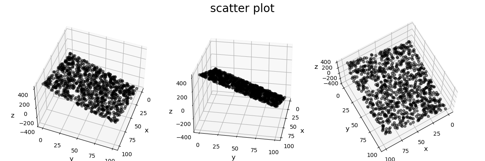
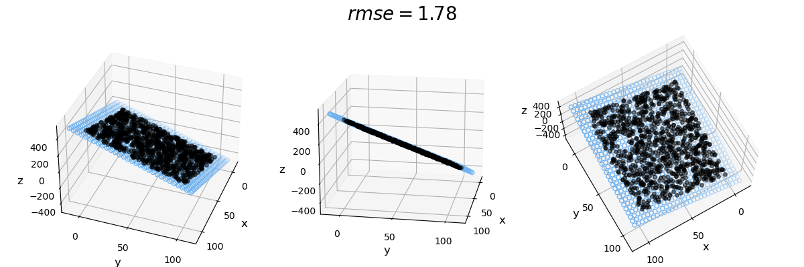

# Report

## 1  线性回归模型

给定含有1000条记录的数据集`mlm.csv`，其中每条记录均包含两个自变量`x`,`y`和一个因变量`z`，它们之间存在较为明显的线性关系。

**任务：请对数据进行三维可视化分析，并训练出良好的线性回归模型。**

```python
import pandas as pd
import numpy as np
import matplotlib.pyplot as plt
import glob
from PIL import Image

# Data preperation
df = pd.read_csv('mlm.csv')
print(df.head())
X = df[['x', 'y']]
Y = df['z']
```

       x      y           z
       
0  64.32   6.21  236.522049

1   9.76  86.65 -283.187014

2  18.33  32.97  -48.807113

3  44.73  93.60 -167.729663

4  40.39  27.69   60.373880

```python
# Prepare data for visualization
x = df['x']
y = df['y']
z = Y

# Functions to visualize data
def set_ax(ax):
    ax.set_xlabel('x', fontsize=12)
    ax.set_ylabel('y', fontsize=12)
    ax.set_zlabel('z', fontsize=12)
    ax.locator_params(nbins=5, axis='x')
    ax.locator_params(nbins=5, axis='y')

def set_fig(fig, title, elev1, azim1, elev2, azim2, elev3, azim3):
    ax1 = fig.add_subplot(131, projection='3d')
    ax2 = fig.add_subplot(132, projection='3d')
    ax3 = fig.add_subplot(133, projection='3d')
    axes = [ax1, ax2, ax3]
    ax1.view_init(elev=elev1, azim=azim1)
    ax2.view_init(elev=elev2, azim=azim2)
    ax3.view_init(elev=elev3, azim=azim3)
    fig.suptitle(title, fontsize=20)
    fig.tight_layout()
    return axes

# Plot data points
plt.style.use('default')
fig = plt.figure(figsize=(12, 4))
axes = set_fig(fig, 'scatter plot', 50, 20, 28, 10, 70, 60)
for ax in axes:
    ax.scatter(x, y, z, c='k', marker='o', alpha=0.5)
    set_ax(ax)
```


```python
# Linear regression model class using normal equation to fit
class LinearRegression(object):
    def __init__(self):
        self._theta = None
        self.intercept_ = None
        self.coef_ = None

    def predict(self, x):
        X_b = np.hstack([np.ones((len(x), 1)), x])
        return X_b.dot(self._theta)

    def fit(self, x, y):
        X_b = np.hstack([np.ones((len(x), 1)), x])
        self._theta = np.linalg.inv(X_b.T.dot(X_b)).dot(X_b.T).dot(y)
        self.intercept_ = self._theta[0]
        self.coef_ = self._theta[1:]

# Train
m = LinearRegression()
m.fit(X, Y)
print(m.coef_)
predicted = m.predict(X)
```
[ 4.02128315 -3.77089441]

```python
# Use RMSE for evaluation
rmse = np.sqrt(((predicted - Y) ** 2).sum() / y.shape[0])
print(rmse)
```
1.7772455720869125

```python
# Prepare data for predicted hyperplane visualization
x_pred = np.linspace(-10, 110, 30)  # range of x
y_pred = np.linspace(-10, 110, 30)  # range of y
xx_pred, yy_pred = np.meshgrid(x_pred, y_pred)
model_viz = np.array([xx_pred.flatten(), yy_pred.flatten()]).T
predicted = m.predict(model_viz)

# Plot data points and predicted hyperplane
fig2 = plt.figure(figsize=(12, 4))
axes = set_fig(fig2, '$rmse = %.2f$' %rmse, 36, 20, 17, 10, 70, 60)
for ax in axes:
    ax.plot(x, y, z, color='k', zorder=15, linestyle='none', marker='o', alpha=0.5, markersize=4)
    ax.scatter(xx_pred.flatten(), yy_pred.flatten(), predicted, facecolor=(0, 0, 0, 0), s=20, edgecolor='#70b3f0')
    set_ax(ax)

plt.show()
```


```python
# Plot data points and predicted hyperplane to gif
fig3 = plt.figure(figsize=(4, 4))
fig3.tight_layout()
fig3.suptitle('$rmse = %.2f$' %rmse, fontsize=20)
ax = fig3.add_subplot(111, projection='3d')
ax.plot(x, y, z, color='k', zorder=15, linestyle='none', marker='o', alpha=0.5, markersize=4)
ax.scatter(xx_pred.flatten(), yy_pred.flatten(), predicted, facecolor=(0, 0, 0, 0), s=20, edgecolor='#70b3f0')
set_ax(ax)
for ii in np.arange(0, 360, 1):
    ax.view_init(elev=17, azim=ii)
    fig3.savefig('gif/gif_image%03d.png' %ii)

# filepaths
fp_in = "gif/gif_image*.png"
fp_out = "image.gif"

# https://pillow.readthedocs.io/en/stable/handbook/image-file-formats.html#gif
img, *imgs = [Image.open(f) for f in sorted(glob.glob(fp_in))]
img.save(fp=fp_out, format='GIF', append_images=imgs,
         save_all=True, duration=25, loop=0)
```


## 2  非线性多分类器

鸢尾花数据集`iris.csv`含有150条记录，每条记录包含萼片长度`sepal length`、萼片宽度`sepal width`、
花瓣长度`petal length`和花瓣宽度`petal width`四个数值型特征，以及它的所属类别`class`（可能为`Iris-setosa`,`Iris-versicolor`,`Iris-virginica`三者之一）。

**任务：请利用该数据集训练出一个良好的非线性分类器。**

### 备注

任务一的数据集由笔者自行模拟随机生成，任务二的Iris数据集来源于UCI Machine Learning Repository。
